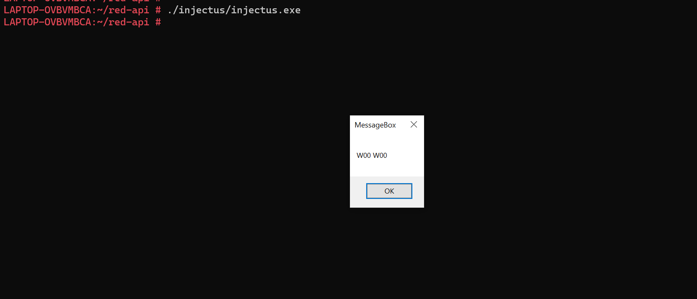

# red-api

`red-api` is an API endpoint designed for delivering dynamically generated payloads. This project is structured into two main components: the API endpoint itself (`webapi`) and a payload executor (`injectus`).

## Overview

- **WebAPI**: Serves dynamically generated payloads, making it more challenging to fingerprint.
- **Injectus**: Fetches the payload from `webapi`, reorganizes it, and executes it.

The primary purpose of this project is to provide a playground for experimenting with payload delivery and execution, showcasing techniques like string obfuscation and base64 encoding. It's a  test bed for local EDR testing and static analysis.

### Payload Demonstration

The payload, generated by `msfvenom`, is designed to display a messagebox as demonstrated below:



## Components

### WebAPI

Located in the `webapi` directory, this component is responsible for serving the payload. Each request to the API returns a payload with slight variations, thereby reducing the possibility of detection through fingerprinting.

### Injectus

Found in the `injectus` directory, this component fetches the payload from `webapi`, performs necessary reorganization, and then executes it. This demonstrates a practical application of payload delivery and execution techniques.

## Usage

```
# client
$ make client
```

```
# server
$ docker-compose build && docker-compose up # listen on port 8080
```

```
$ ./injectus/injectus # and you should see the messagebox
```


## Testing and Development

This project is intended for testing and educational purposes in controlled environments. It's a playground for exploring various aspects of payload management and execution, offensive golang and evasion techniques.